# Document Management and RAG Q&A - Backend Services

This monorepo contains the backend microservices for the Document Management and RAG Q&A application. It includes services for authentication, user management, document handling, and ingestion, all designed to work together in a containerized environment.



## Architecture Overview

The backend consists of four NestJS microservices and one Python service for RAG processing.
-   **Auth Service:** Handles user registration and login (Port `3001`).
-   **Users Service:** Provides CRUD operations for user management (Port `3002`).
-   **Documents Service:** Manages document metadata and local file uploads (Port `3003`).
-   **Ingestion Service:** Triggers the document processing pipeline via RabbitMQ (Port `3004`).
-   **Python RAG Service:** Processes documents, generates embeddings, and answers questions (Port `8000`).

## Prerequisites

-   [Docker](https://www.docker.com/products/docker-desktop/) and Docker Compose
-   [Node.js](https://nodejs.org/) (v18 or higher)
-   [npm](https://www.npmjs.com/) (v9 or higher)

## Local Development Setup

### 1. Clone the Repository
Clone this monorepo and navigate into the root directory.

### 2. Install Dependencies
Install the Node.js dependencies for all microservices.
```bash
npm install
```

### 3. Configure Environment Variables
Create a `.env` file in the root of this monorepo and copy the contents from `.env.example` (or use the one we've built). This file contains the necessary database URLs, JWT secrets, and RabbitMQ connection strings.

### 4. Build and Run the Entire Stack
This single command will build the Docker images for all services and start the required infrastructure (PostgreSQL, RabbitMQ).

```bash
docker compose up --build
```
-   The `--build` flag is only necessary the first time you run the command or after making changes to any `Dockerfile`.
-   To run the containers in the background, use `docker compose up -d --build`.

### 5. Initialize the Database
After the containers are running, you need to apply the database migrations and set up the `pgvector` extension.

1.  **Apply Migrations:**
    ```bash
    npx prisma migrate dev
    ```
2.  **Enable `pgvector` and Create Tables:**
    -   Connect to the PostgreSQL container:
        ```bash
        docker exec -it postgres_db psql -U docker -d auth_db
        ```
    -   Run the following commands inside the `psql` shell:
        ```sql
        CREATE EXTENSION IF NOT EXISTS vector;
        \q
        ```
    -   Run the setup script for the vector table (assuming you are in the `python-rag-service` directory):
        ```powershell
        # For PowerShell
        Get-Content setup.sql | docker exec -i postgres_db psql -U docker -d auth_db
        ```

## Testing

Each NestJS microservice (`auth`, `users`, `documents`, `ingestion`) comes with a full suite of unit and end-to-end (E2E) tests using Jest.

To run the tests for a specific service, use the following commands from the root of the monorepo:

```bash
# Run unit tests for the auth service
npm run test auth

# Run E2E tests for the auth service
npm run test:e2e auth
```
Replace `auth` with the name of the service you wish to test (e.g., `users`, `documents`).

## Accessing Services

-   **Auth Service:** `http://localhost:3001` (Swagger: `/api`)
-   **Users Service:** `http://localhost:3002` (Swagger: `/api`)
-   **Documents Service:** `http://localhost:3003` (Swagger: `/api`)
-   **Ingestion Service:** `http://localhost:3004` (Swagger: `/api`)
-   **Python RAG Service:** `http://localhost:8000` (API Docs: `/docs`)
-   **RabbitMQ Management:** `http://localhost:15672` (user: `guest`, pass: `guest`)